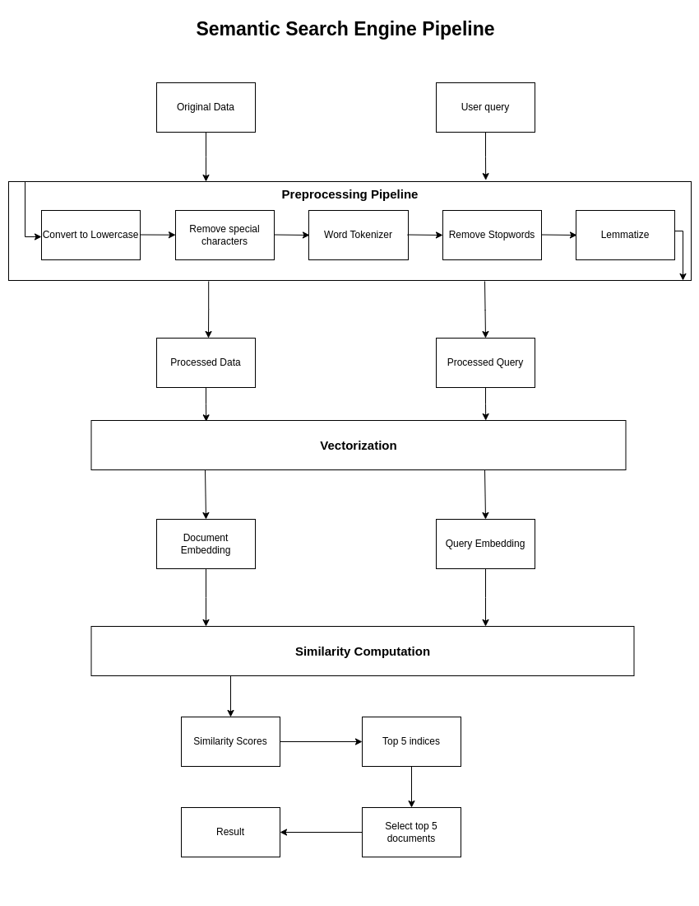
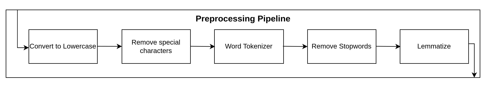

# Semantic Search Engine

The Semantic Search Engine is a powerful tool designed to understand the meaning and context behind search queries, providing more accurate and relevant results compared to traditional keyword-based search systems. By leveraging natural language processing (NLP) and machine learning techniques, our search engine can interpret user intent and match it with the most appropriate content from the indexed database.

## Working demo


## Installation Guide

To install the Semantic Search Engine, follow these steps:

```bash {"id":"01J9G4HAPYNM9TZ9BKXE7W7DXJ"}
git clone https://github.com/SameerCrestha/semantic-search-engine
cd semantic_search_engine
pip install -r requirements.txt
```

To run fastapi app:

```bash {"id":"01J9G4HAPYNM9TZ9BKXHEGBZ9Q"}
fastapi run src/api.py
```

## Project architecture



### Work flow:

1. The dataset is passed through the preprocessing pipeline and vector embedding of this processed data is stored as doucment embeddings.
2. The user query is passed through the preprocessing pipeline and vector embedding of this processed query is generated as query embeddings.
3. The query embeddings are compared with the document embeddings and the most similar documents are returned.

## Preprocessing pipeline


The steps in the preprocessing pipeline are as follows:

1. Convert to Lower case
   - Converts all characters in the text to lowercase.
   - This step ensures that "Apple" and "apple" are treated the same during vectorization.
2. Remove special characters
   - Strips out punctuation and special characters (e.g., !, @, #, etc.) that don’t contribute to the meaning of the sentence.
   - This is important for simplifying the text and focusing on meaningful content.
3. Work Tokenization
   - Tokenization splits the text into individual words (tokens).
   - This is an essential step before applying further preprocessing like removing stopwords or lemmatization.
4. Remove Stop words
   - Stopwords (e.g., "is", "the", "and") are common words that don't carry significant meaning.
   - Removing them reduces noise and improves the relevance of the vector representation.
5. Lemmatization
   - Lemmatization reduces words to their base or dictionary form (lemma).
   - For example, "running" becomes "run", and "better" becomes "good".
   - This helps to standardize the text and group words with similar meanings.

## Vectorization

The embeddings are generated using the [sentence-transformers/all-MiniLM-L6-v2](https://huggingface.co/sentence-transformers/all-MiniLM-L6-v2) model. This is a sentence-transformers model: It maps sentences & paragraphs to a 384 dimensional dense vector space and can be used for tasks like clustering or semantic search. The model is relatively lightweight and fast, making it suitable for real-time applications. TF-IDF vectorization is also implemented in the project but not used for the application.

## Similarity Computation

In the application, cosine similarity is used to measure how similar two vectors (the query embedding and a document embedding) are. Cosine similarity measures the angle between two vectors in the vector space, providing a value between -1 and 1:

- 1 indicates that the vectors are identical.
- 0 means the vectors are orthogonal (no similarity).
- -1 indicates that the vectors are opposite.
