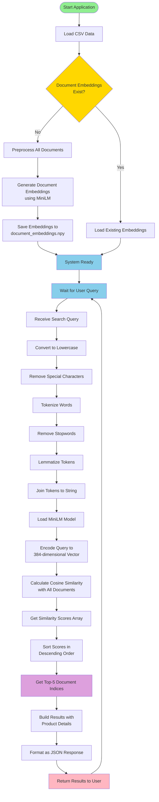

# Activity Diagram - Semantic Search Engine

This activity diagram shows the workflow of the semantic search process from initialization to returning results.

## Workflow Phases

### 1. Initialization Phase
- **Load CSV Data**: Read product data from processed_data.csv
- **Check Embeddings**: Determine if document embeddings already exist
- **Generate/Load Embeddings**: Either create new embeddings or load existing ones
  - If not exists: Preprocess all documents → Generate embeddings → Save to file
  - If exists: Load from document_embeddings.npy

### 2. Request Processing Phase
- **Receive Query**: User submits search query through API
- **Preprocessing Pipeline**:
  1. Convert text to lowercase
  2. Remove special characters and punctuation
  3. Tokenize text into individual words
  4. Remove stopwords (common words without semantic value)
  5. Lemmatize words to their base form
  6. Join processed tokens back into string

### 3. Vectorization Phase
- **Load Model**: Initialize SentenceTransformer MiniLM model
- **Encode Query**: Convert preprocessed query into 384-dimensional embedding vector

### 4. Search Phase
- **Calculate Similarity**: Compute cosine similarity between query embedding and all document embeddings
- **Get Scores**: Retrieve similarity scores for all documents

### 5. Ranking Phase
- **Sort Scores**: Arrange documents by similarity score in descending order
- **Get Top-K**: Select top 5 most relevant documents

### 6. Response Phase
- **Build Results**: Gather product details for top-ranked documents
  - Product name, URL, price, rating, reviews, manufacturer
  - Similarity score
- **Format JSON**: Structure data as JSON response
- **Return Results**: Send response back to user

### 7. Loop
- System returns to waiting for next query
