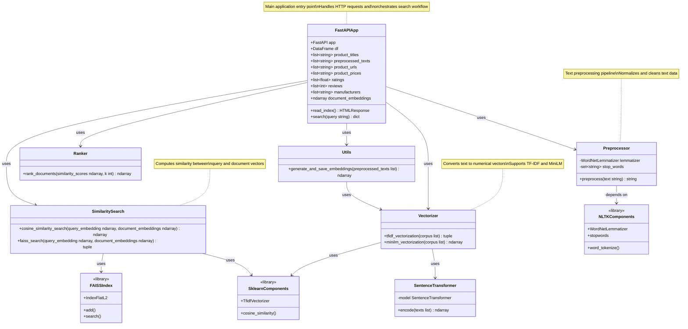

# Class Diagram - Semantic Search Engine

This class diagram shows the main components and their relationships in the semantic search engine.

## Component Descriptions

### FastAPIApp
- **Purpose**: Main application server that orchestrates the search workflow
- **Responsibilities**: 
  - Serves HTTP endpoints
  - Loads and manages document embeddings
  - Coordinates between preprocessing, vectorization, search, and ranking
  - Returns formatted search results

### Preprocessor
- **Purpose**: Prepares text for vectorization
- **Responsibilities**:
  - Lowercase conversion
  - Special character removal
  - Tokenization
  - Stopword removal
  - Lemmatization

### Vectorizer
- **Purpose**: Converts text to numerical representations
- **Responsibilities**:
  - TF-IDF vectorization (alternative method)
  - MiniLM sentence embeddings (primary method)
  - Returns 384-dimensional vectors

### SimilaritySearch
- **Purpose**: Compares query vectors with document vectors
- **Responsibilities**:
  - Cosine similarity computation
  - FAISS-based nearest neighbor search (alternative method)

### Ranker
- **Purpose**: Ranks documents based on similarity scores
- **Responsibilities**:
  - Sorts similarity scores
  - Returns top-k most relevant documents

### Utils
- **Purpose**: Helper functions for the application
- **Responsibilities**:
  - Generate and save document embeddings
  - Utility operations
