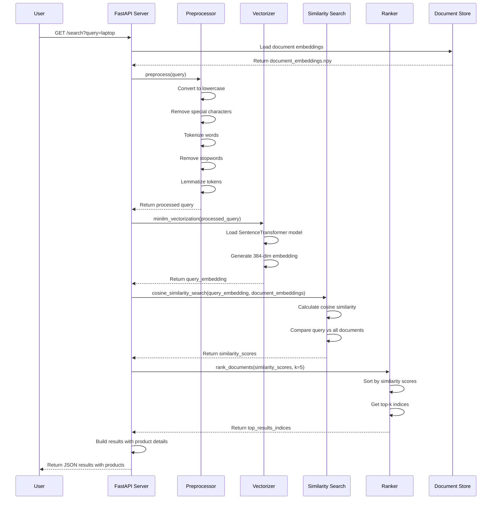

# Sequence Diagram - Semantic Search Engine

This sequence diagram shows the flow of a search request through the semantic search engine system.

## Flow Description

1. **User Request**: User sends a search query through the GET endpoint
2. **Load Embeddings**: FastAPI loads pre-computed document embeddings from storage
3. **Preprocessing**: Query text is cleaned and normalized:
   - Convert to lowercase
   - Remove special characters
   - Tokenize into words
   - Remove stopwords (common words like "the", "is", etc.)
   - Lemmatize (reduce words to base form)
4. **Vectorization**: Processed query is converted to 384-dimensional embedding using MiniLM model
5. **Similarity Search**: Query embedding is compared against all document embeddings using cosine similarity
6. **Ranking**: Documents are ranked by similarity scores and top-k results are selected
7. **Response**: Results are formatted with product details and returned to user
